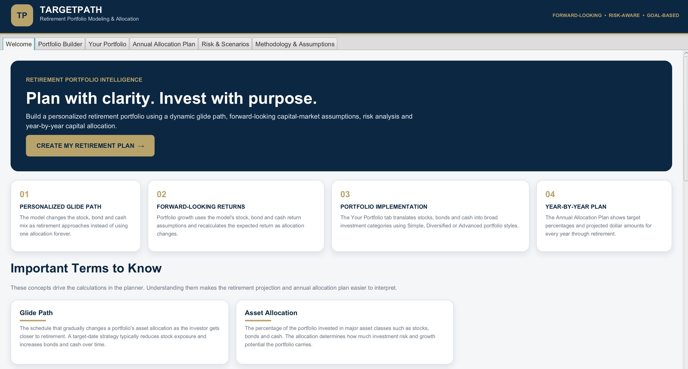
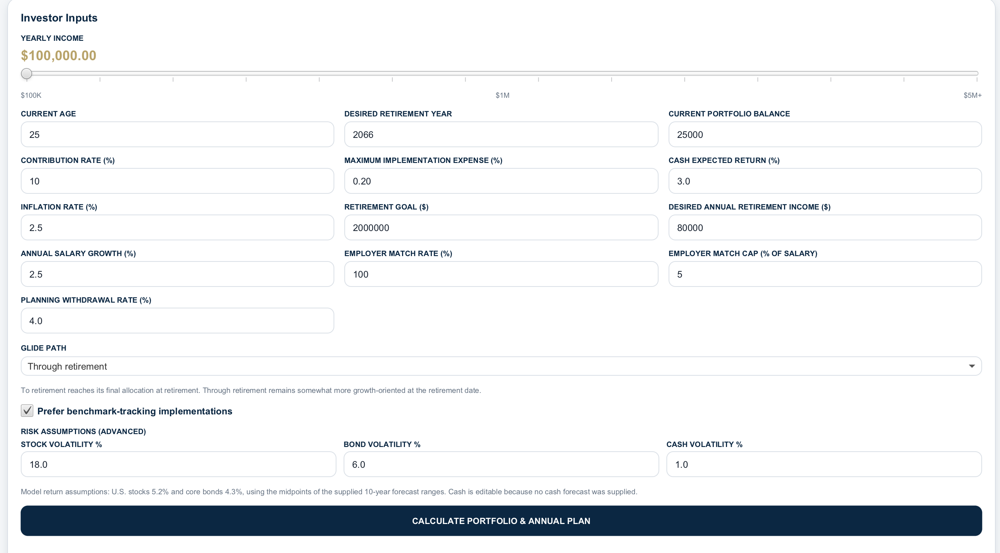
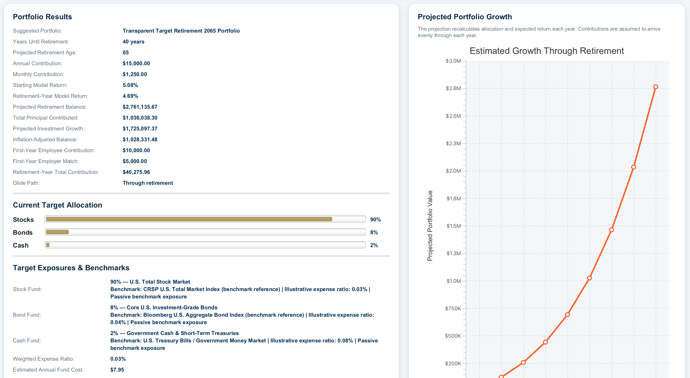
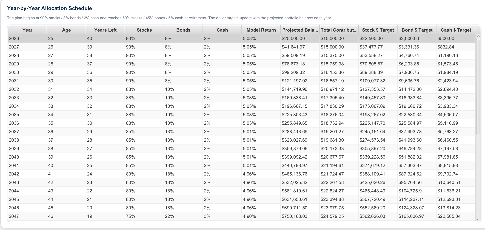
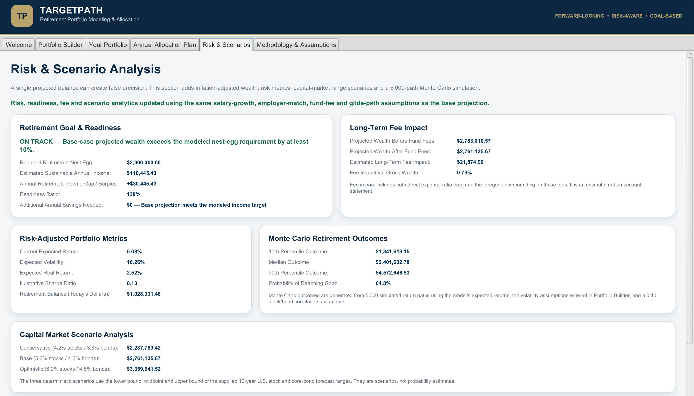

# TargetPath Portfolio Model

**Dynamic Asset Allocation • Retirement Modeling • Portfolio Risk Analytics**

TargetPath is a Java/JavaFX portfolio modeling application designed to explore dynamic target-date investment strategies, long-term retirement outcomes, portfolio construction, and investment risk.

The application combines investor-specific inputs with forward-looking capital market assumptions, dynamic glide paths, benchmark-based asset allocation, Monte Carlo simulation, risk analytics, investment fee modeling, and retirement-readiness analysis.

Developed as an independent finance and programming project by **Luke Slattery, Georgia Institute of Technology**.

---

## Application Preview

### Welcome & Investor Education

TargetPath introduces investors to the portfolio modeling process and provides explanations of important investment concepts used throughout the application.



### Portfolio Builder — Investor Inputs

Investors can enter their age, income, current portfolio balance, retirement horizon, contribution assumptions, employer match, salary growth, retirement-income objective, and other planning variables.



### Portfolio Builder — Results

TargetPath converts investor inputs into a dynamic target-date portfolio, projected retirement wealth, asset allocation, expected return, investment cost analysis, and long-term portfolio growth projection.



### Portfolio Construction & Investment Guidance

The model translates strategic asset-allocation targets into benchmark-based investment exposures while providing additional information about how the portfolio is constructed.


### Annual Capital Allocation Plan

The annual allocation model shows how stock, bond, and cash exposure changes each year as the investor approaches retirement.

The plan also estimates the dollar amount of capital allocated to each major asset class based on projected portfolio value.



### Risk & Scenario Analysis

TargetPath incorporates Monte Carlo simulation, expected volatility, inflation-adjusted returns, risk metrics, and conservative, base, and optimistic scenarios to illustrate uncertainty surrounding long-term investment outcomes.



---

## Key Features

- Dynamic target-date glide-path modeling
- Year-by-year asset allocation
- Forward-looking capital market assumptions
- Benchmark-based portfolio construction
- Projected retirement wealth
- Inflation-adjusted retirement wealth
- Salary-growth modeling
- Employee contribution modeling
- Employer matching contributions
- Investment fee-drag analysis
- Retirement-income readiness analysis
- 5,000-path Monte Carlo simulation
- Conservative, base, and optimistic market scenarios
- Expected portfolio volatility
- Expected real return
- Illustrative Sharpe ratio
- Retirement-goal probability analysis
- Year-by-year stock, bond, and cash capital allocation
- Simple, diversified, and advanced portfolio structures
- Investor education and methodology explanations

---

## Financial Modeling Framework

TargetPath is designed as an educational portfolio-construction and retirement modeling platform.

The model connects an investor's retirement horizon, savings behavior, asset allocation, expected returns, risk assumptions, investment costs, and retirement objectives into a single long-term projection framework.

The investment process follows this general structure:

**Investor Profile → Savings Strategy → Capital Market Assumptions → Target Asset Allocation → Dynamic Glide Path → Risk Analysis → Retirement Projection**

Rather than assuming that an investor maintains one portfolio allocation throughout an entire investment horizon, TargetPath dynamically changes the allocation between equities, fixed income, and cash as retirement approaches.

---

## Dynamic Glide Path

TargetPath uses a target-date glide-path framework that gradually adjusts portfolio risk as an investor approaches retirement.

Investors with longer retirement horizons generally receive higher equity allocations because they have more time to tolerate market volatility and participate in long-term economic growth.

As retirement approaches, the model gradually increases fixed-income and cash exposure.

For example, an investor far from retirement may have a portfolio heavily weighted toward equities, while an investor approaching retirement may receive a substantially larger bond allocation.

The glide path is recalculated throughout the investor's retirement horizon rather than applying one static allocation.

This allows both the portfolio allocation and expected portfolio return to evolve over time.

---

## Capital Market Assumptions

TargetPath uses forward-looking capital market assumptions rather than simply extrapolating historical market returns indefinitely.

The base model currently uses approximately:

| Asset Class | Expected Annual Return |
|---|---:|
| U.S. Equities | 5.2% |
| Core Bonds | 4.3% |
| Cash | 3.0% |

These assumptions are combined according to the portfolio's asset allocation to determine the expected portfolio return.

For example, a stock-heavy portfolio receives a different expected return from a portfolio containing substantially more bonds and cash.

As the glide path changes, the model recalculates the expected portfolio return.

These assumptions are illustrative modeling inputs and are not forecasts or guarantees of future investment performance.

---

## Scenario Analysis

TargetPath incorporates multiple capital-market scenarios to demonstrate how different return environments could affect long-term retirement outcomes.

The application evaluates:

### Conservative Scenario

Designed to represent a lower-return capital-market environment.

### Base Scenario

Represents the central assumptions used by the primary retirement projection.

### Optimistic Scenario

Demonstrates the potential effect of stronger long-term market returns.

The model therefore avoids presenting a single expected return as the only possible future outcome.

---

## Benchmark-Based Portfolio Construction

TargetPath separates **strategic asset allocation** from the specific investment product used to implement that allocation.

Instead of recommending individual stocks, ETFs, or mutual funds, the model identifies desired market exposures using recognizable benchmark indexes and broad investment categories.

Modeled exposures may include benchmark references such as:

- CRSP U.S. Total Market Index
- S&P 500 Index
- Bloomberg U.S. Aggregate Bond Index
- Bloomberg U.S. Treasury Index
- U.S. Treasury bills
- Government money-market exposure

This framework follows the general investment process:

**Asset Allocation → Market Exposure → Benchmark → Implementation**

This allows TargetPath to focus on portfolio construction rather than recommending specific securities or financial providers.

Benchmark names are used solely to describe modeled market exposures.

TargetPath is not affiliated with or endorsed by any index provider or financial institution.

---

## Portfolio Structures

TargetPath allows investors to examine different levels of portfolio complexity.

### Simple

Designed around a smaller number of broad market exposures.

This structure emphasizes diversification and simplicity.

### Diversified

Separates the portfolio into additional asset classes such as U.S. equities, international developed equities, emerging markets, core bonds, and inflation-protected securities.

### Advanced

Provides a more detailed breakdown of equity and fixed-income exposures while maintaining the overall stock, bond, and cash targets determined by the glide path.

Regardless of portfolio structure, the strategic stock, bond, and cash allocation remains connected to the same underlying target-date model.

---

## Annual Capital Allocation

TargetPath generates a year-by-year investment allocation plan from the investor's current year through the selected retirement year.

For each year, the application can display:

- Investor age
- Years remaining until retirement
- Target stock allocation
- Target bond allocation
- Target cash allocation
- Expected portfolio return
- Projected portfolio balance
- Annual investment contributions
- Dollar amount allocated to stocks
- Dollar amount allocated to bonds
- Dollar amount allocated to cash

This allows the investor to see not only where the portfolio is expected to end, but how the investment strategy evolves along the way.

The Annual Allocation Plan and the detailed portfolio allocation use the same underlying glide-path engine.

---

## Portfolio Projection

TargetPath projects portfolio growth using:

- Current investment balance
- Annual income
- Employee contribution rate
- Employer matching contributions
- Salary growth
- Dynamic asset allocation
- Expected asset-class returns
- Investment expenses
- Retirement horizon

Contributions are modeled throughout each year rather than assuming that the entire annual contribution is invested on the first day of the year.

Expected portfolio returns change as the investor's glide-path allocation changes.

---

## Contributions & Employer Match

TargetPath models investor contributions dynamically rather than assuming that contributions remain unchanged indefinitely.

The model incorporates:

- Current annual income
- Employee contribution rate
- Expected annual salary growth
- Employer matching contribution
- Employer match limits
- Changing annual contributions through retirement

As modeled income grows, employee contributions can increase accordingly.

Employer contributions are also incorporated into the portfolio projection based on the assumptions entered by the user.

This creates a more realistic accumulation model than assuming a constant dollar contribution throughout an investor's entire career.

---

## Investment Fees

Investment expenses reduce the amount of capital available to compound over time.

TargetPath incorporates illustrative implementation expense ratios into portfolio projections.

The application compares:

- Projected wealth before investment expenses
- Projected wealth after investment expenses
- Estimated long-term fee impact
- Fee impact as a percentage of projected wealth

This analysis captures both the direct cost of investment expenses and the potential investment growth that is lost when those expenses are removed from the portfolio.

Expense ratios used by the application are illustrative implementation assumptions and do not represent recommendations for specific investment products.

---

## Inflation

A future dollar does not necessarily have the same purchasing power as a dollar today.

TargetPath therefore distinguishes between:

**Nominal Retirement Wealth**

and

**Inflation-Adjusted Retirement Wealth**

The application uses an inflation assumption to estimate the purchasing power of the projected retirement portfolio in today's dollars.

This helps prevent large future nominal portfolio balances from being interpreted as having the same economic value as an equivalent amount today.

---

## Monte Carlo Simulation

A single deterministic projection cannot fully represent the uncertainty associated with long-term investing.

TargetPath therefore includes a **5,000-path Monte Carlo simulation**.

The simulation models thousands of potential investment paths using expected portfolio returns and volatility assumptions.

The Monte Carlo analysis reports:

- 10th percentile retirement outcome
- Median retirement outcome
- 90th percentile retirement outcome
- Probability of reaching the investor's selected retirement goal

This allows users to evaluate a distribution of potential outcomes rather than relying exclusively on one projected portfolio value.

Monte Carlo analysis does not predict future returns. It illustrates how uncertainty and market variability can affect long-term outcomes under the model's assumptions.

---

## Risk Analytics

TargetPath incorporates several portfolio risk measures to help evaluate the relationship between expected return and investment risk.

The model includes:

- Expected portfolio return
- Expected portfolio volatility
- Expected real return
- Illustrative Sharpe ratio
- Conservative market scenario
- Base market scenario
- Optimistic market scenario
- Monte Carlo outcome distribution
- Probability of reaching a retirement goal

Expected portfolio volatility changes according to the portfolio's stock, bond, and cash allocation.

As the glide path becomes more conservative, both expected return and modeled portfolio risk can change.

---

## Retirement Readiness

The application compares projected retirement wealth with an investor-defined retirement-income objective.

TargetPath evaluates:

- Desired annual retirement income
- Required retirement portfolio
- Projected retirement balance
- Estimated sustainable portfolio income
- Retirement-income surplus or shortfall
- Readiness ratio
- Estimated additional annual savings required

The resulting readiness assessment may classify an investor as:

- **On Track**
- **Near Target**
- **Below Target**

This feature connects portfolio accumulation with an actual retirement objective rather than presenting projected wealth without context.

The retirement-readiness analysis focuses on the investment portfolio itself.

It does not currently incorporate Social Security benefits, pensions, detailed tax liabilities, healthcare expenses, or other outside retirement-income sources.

---

## Why Forward-Looking Returns?

Historical market returns can provide useful context, but historical averages are not guaranteed to repeat.

TargetPath therefore uses forward-looking return assumptions as modeling inputs.

The objective is not to predict exactly what markets will return, but to create a framework in which portfolio outcomes respond logically to different capital-market environments.

Scenario analysis and Monte Carlo simulation are included because long-term investment outcomes are inherently uncertain.

---

## Technology

TargetPath was developed using:

- **Java**
- **JavaFX**
- **Maven**
- **Object-Oriented Programming**
- **Financial Modeling**
- **Monte Carlo Simulation**
- **Scenario Analysis**
- **Dynamic Asset Allocation**
- **Portfolio Risk Analysis**

---

## How to Run

### Requirements

- Java 21 or compatible JDK
- Maven
- JavaFX
- IntelliJ IDEA recommended

### Running with IntelliJ IDEA

1. Clone or download this repository.
2. Open the project folder in IntelliJ IDEA.
3. Allow Maven to load the dependencies specified in `pom.xml`.
4. Navigate to `TargetDateFundApp.java`.
5. Run the `main()` method.

### Running with Maven

From the project directory on macOS or Linux:

```bash
./mvnw javafx:run
```

On Windows:

```bash
mvnw.cmd javafx:run
```

---

## Project Structure

The primary application logic is contained within:

```text
src/main/java/com/example/targetdatefundappjava/TargetDateFundApp.java
```

The repository also includes:

```text
src/        Java source files
images/     Application screenshots
pom.xml     Maven project configuration
README.md   Project documentation
.mvn/       Maven wrapper configuration
mvnw        Maven wrapper for macOS/Linux
mvnw.cmd    Maven wrapper for Windows
```

---

## Model Limitations

TargetPath is intentionally focused on portfolio accumulation, strategic asset allocation, investment risk, and retirement modeling.

The current model does not fully incorporate:

- Social Security benefits
- Pension income
- Federal income taxes
- State income taxes
- Capital-gains taxes
- Required minimum distributions
- Healthcare expenses
- Medicare expenses
- Detailed retirement spending patterns
- Changes in future tax law
- Individual stock selection
- Individual bond selection
- Actual future market returns
- Behavioral changes by investors during periods of market volatility

The model also assumes that the investor follows the modeled contribution and asset-allocation strategy.

Actual investor behavior and market conditions can differ materially.

---

## Project Purpose

TargetPath was developed as an independent finance and programming project to explore how portfolio-management concepts can be translated into a functioning investment model.

The project applies concepts including:

- Strategic asset allocation
- Target-date glide paths
- Portfolio construction
- Diversification
- Capital market assumptions
- Risk and return
- Portfolio volatility
- Monte Carlo simulation
- Scenario analysis
- Inflation-adjusted wealth
- Investment fee drag
- Employer contributions
- Retirement readiness
- Year-by-year capital allocation

The objective of the project is to demonstrate the connection between **financial theory, quantitative modeling, portfolio construction, and software development**.

---

## Author

**Luke Slattery**  
Finance Student  
**Georgia Institute of Technology**

---

## Disclaimer

TargetPath is an educational financial-modeling project.

It does **not** provide investment, tax, legal, accounting, or fiduciary advice.

The application does not recommend the purchase or sale of any specific stock, bond, ETF, mutual fund, security, or other financial product.

Capital market assumptions, expected returns, volatility estimates, expense ratios, inflation assumptions, withdrawal rates, scenario results, and Monte Carlo outputs are illustrative modeling inputs.

Actual investment outcomes may differ materially from modeled results.

Past performance does not guarantee future results.

Benchmark names are referenced solely to identify modeled market exposures. No affiliation with or endorsement by any index provider, financial institution, university, or other third party is implied.

© 2026 Luke Slattery. All rights reserved.
Last updated: August 2026
